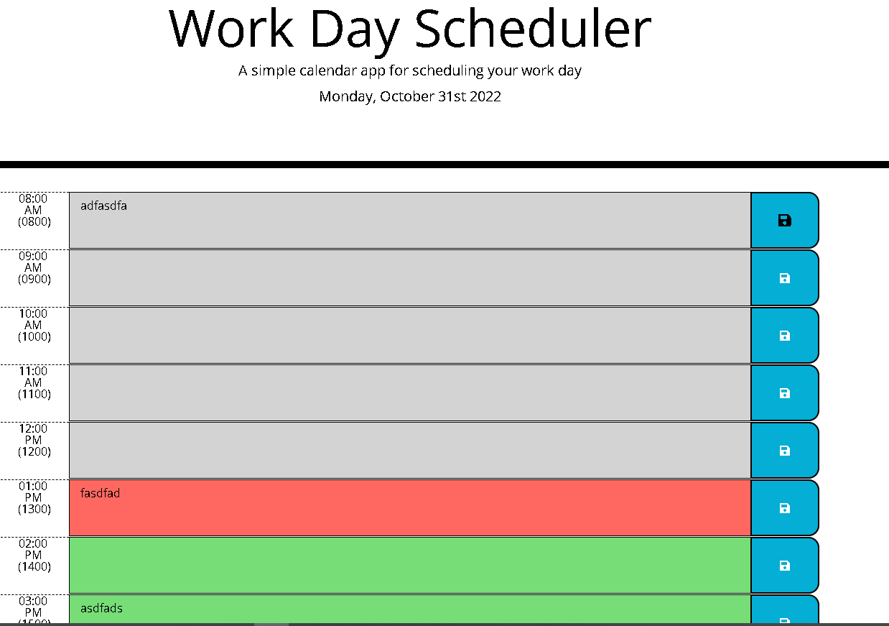

# Week-5-Challenge-Planner
## Third-Party APIs: Work Day Scheduler

### Challenge Goals
 * Create an app that will run in the browser utilizing HTML and CSS dynamically powered by Jquery code.
 * App will use a daily planner to create schedule by inputing information in time blocks to organize user's work day.
 * The app will display the date on time and allow information in time blocks to be saved in local storage allowing data to display after page-refresh.
 * Each time block will be color-coded to display and indicated if the block is from the past, in the present, or is a future task. 
 * Once code base is properly functioning we will have to deploy the application to a live URL and Github URL which displays the site with a proper repository.

## Screenshot

## Status
* All application criterias have been met: 
    * Functional planner which allows the input and storage of data in timeblocks which have been color-coded based on the current status/time of each block.
* CSS has been updated: Save Button & Timeblock Borders have been modified for clear block distinctions and follow hover interactions as the homework-demo.
* Completed all acceptance criteria and have deployed links:
    * Live link: 
    * Github link:
